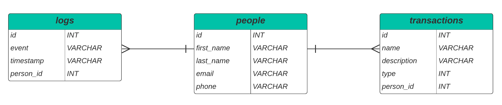

# API LIFECASH

API Rest para registrar as receitas e despesas de uma pessoa!

Temos os seguintes contratos:

- Tabela people: que armazenará informações das pessoas que utilizarão a aplicação;
- Tabela transactions: que armazenará informações sobre as transações de despesa ou receita das pessoas cadastradas;
- Tabela logs: que armazenará os logs das operações realizadas nas tabelas people e transactions.

## Diagrama ER(Entidade Relacionamento)



## Configurações iniciais

- `npm start` roda a api
- `npm run dev` roda a api em ambiente de desenvolvimento com `--watch` nativo do node para hot-reload
- `npm run reset-compose` desce e sobe novamente o compose, **obs: esse comando reseta tudo, inclusive remove todas imagens e containers do sistema**

## Docker

No **Docker Compose** foi adicionado ao serviço de database, `healthcheck`, essa config permite verificar periodicamente se o serviço está saudável, no caso o DB:

```
healthcheck:
      test: ["CMD", "mysqladmin", "ping", "-h", "localhost", "-u", "root", "-proot"]
      interval: 5s
      timeout: 5s
      retries: 5
```

No serviço da API adicionamos um `depends_on` com a condição de inicializar somente se `healthy` retornar "ok".

```
depends_on:
      - database:
          condition: service_healthy # espera o serviço de database estar funcionando de forma saúdavel
```

Usamos no volume do database o arquivo `docker-entrypoint-initdb.d` para subir já com um dump para o MYSQL, o dump é o arquivo `lifecash.sql`. Resumindo se o DB estiver vázio ele usa o dump, caso já exista algo no volume ele desconsidera.

## Conexão com o DB

- Estamos usando o client mysql2 para se comunicar com o DB

Foi criado um Pool de conexões no caminho db/connection.js, este está usando o dotenv para pegar as variáveis, foi definido um limite de 10 conexões simultâneas já que o projeto não necessita de mais e nem de multiplas camadas de pooling.

Temos o arquivo `./db/PeopleDB` que substituí o papel da camada model, comunicando com o DB através das funções do aplicativo mysql2 e querys SQL.

## Tratamento de Erro

Foi construido um middleware para tratar erros globalmente, tornando a api mais limpa, removendo a necessidade de vários `try/catch` na camada controller. Disparamos os erros instânciando a classe `AppError`, uma classe de erro personalizada herdada de `Error`.

O disparo desses erros são realizados dessa maneira:

`throw new AppError(STATUS, MESSAGE_ERROR);`

No Middleware também tratamos `error 500`.

O unico lugar que tratamos error com `try/catch` é no service, pois podem vir exceções do DB caso alguma regra seja infligida.

## Middlewares

Temos a pasta middlewares e dentro a pasta schema, para a validação dos formatos de body, params e querys estamos usando a biblioteca **zod**, para melhor legibilidade e escalabilidade.

Em `middlewares/validateFormat.middleware.js` está um middleware genérico para validar os schemas que serão inseridos na camada de `Routes`.
